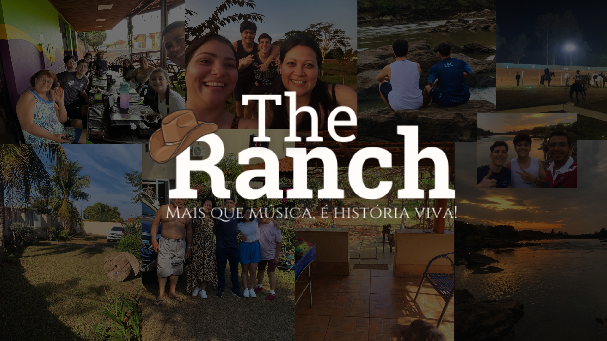

  

# 🎸🌾 **The Ranch – A Alma do Sertanejo na Web!**

> **"Ranch" significa fazenda em inglês.**  
> E se tem um lugar que simboliza o sertanejo, é o campo.  
> É ali que nasceram os primeiros acordes, os causos, as modas de viola e a vida simples que inspira tantas canções.

O **The Ranch** é isso: uma **homenagem à alma do sertanejo** – que brota da terra, do interior, da lida e se transforma em música.  

Aqui, a paixão pela música se transforma em uma **experiência interativa**, feita pra você que **vive o sertanejo de corpo e alma**.  
Nossa missão é te levar por uma **jornada que conecta gerações**, contando histórias de artistas que marcaram época, apresentando novos talentos e celebrando cada acorde que ecoa nas nossas memórias. 🎶

---

## ✨ **Funcionalidades do The Ranch**
- 🎧 **Cantores:** Um pouco sobre cada um dos nomes que marcaram gerações (biografia, hits e mais...).  
- 📜 **História:** trajetória que mostra a evolução do sertanejo, desde suas raízes até os dias atuais.  
- ❓ **Quiz Sertanejo:** Teste seus conhecimentos sobre o mundo sertanejo.  
- 📊 **Dashboard:** Acompanhe seus resultados, rankings e o estilo mais ouvido do momento.  

---

# 🐎🌵 The Ranch – O Sertanejo Mora Aqui!
- Desenvolvido por **Diogo Procopio**.

  

